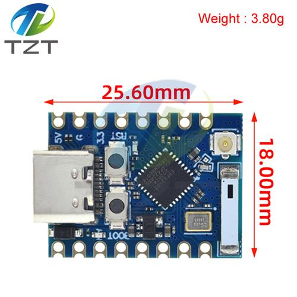
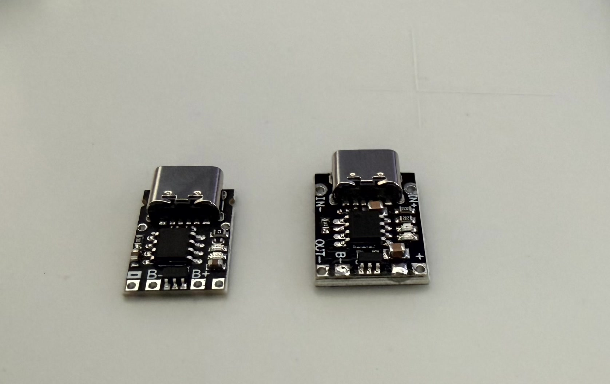
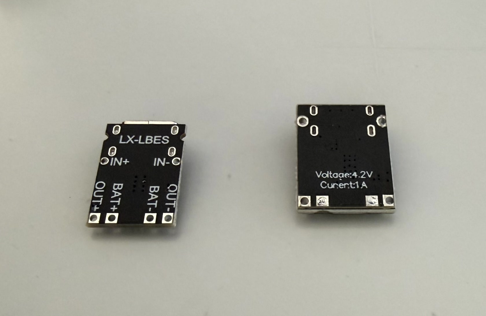
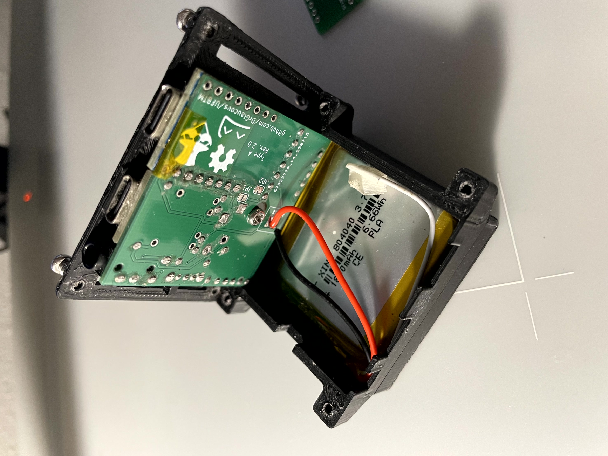
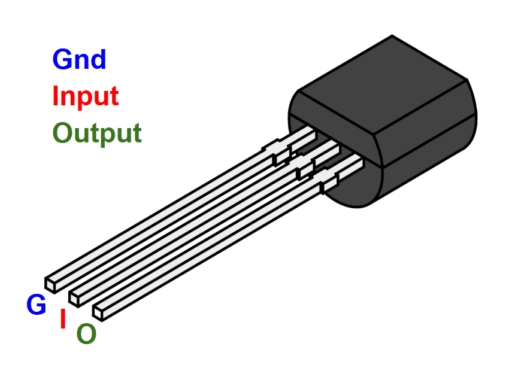
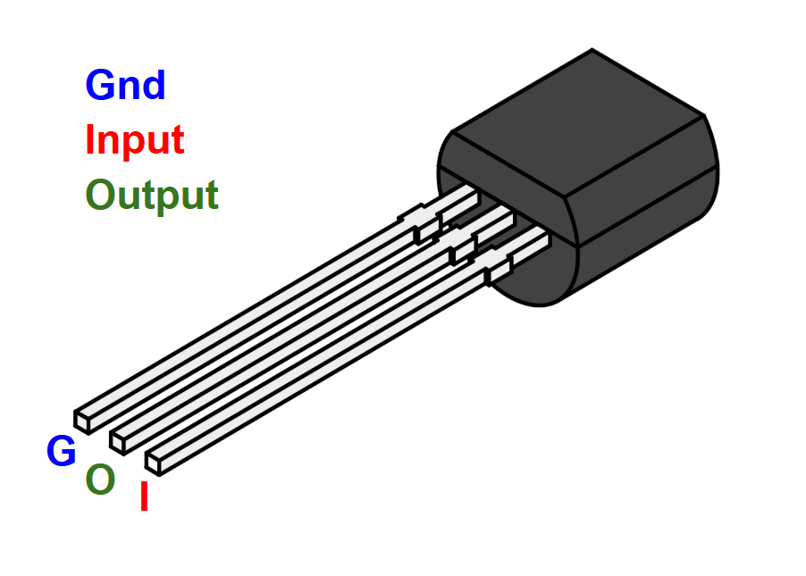
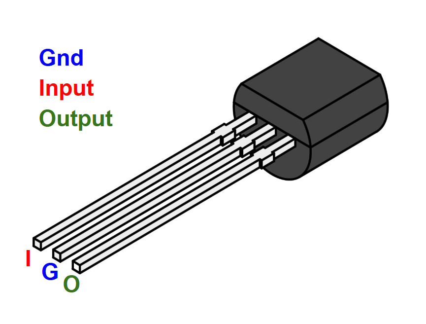
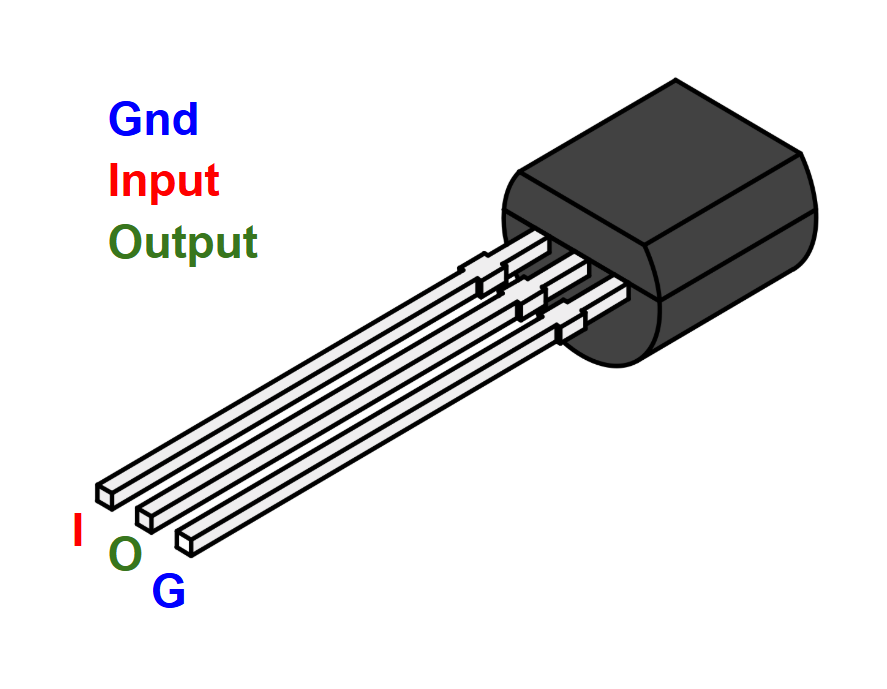
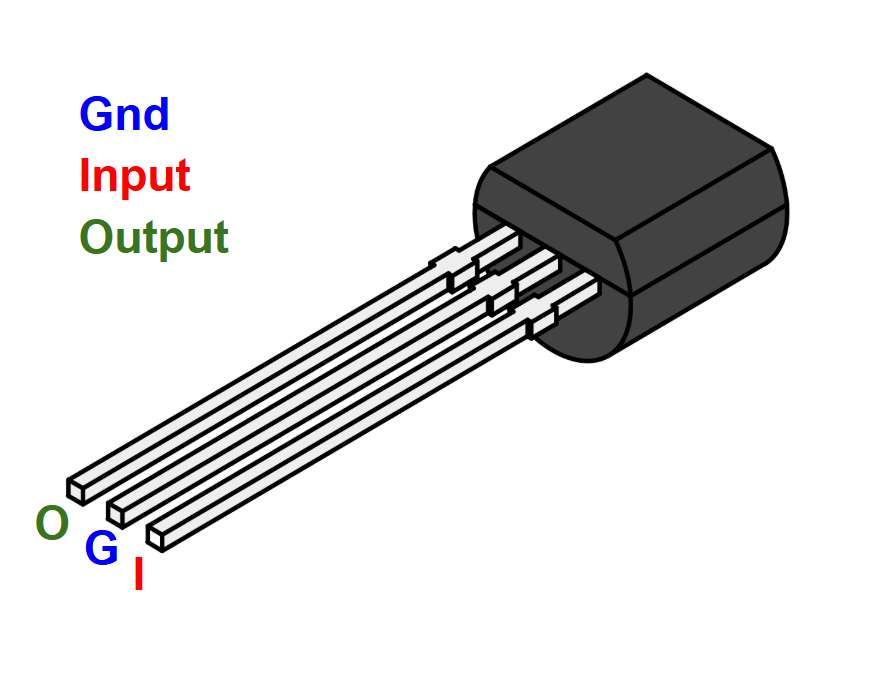
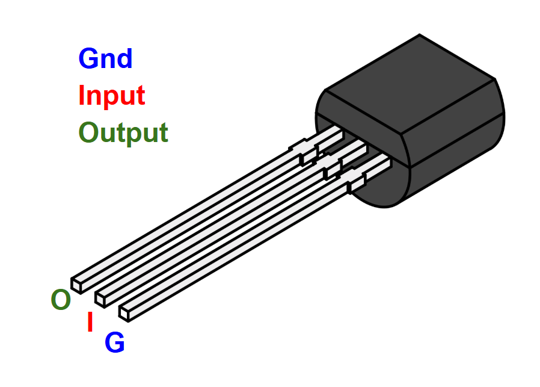

# UFBTM
~~*Unnamed Full Body Tracking modules*~~

*They have a name now...*
# Mr. Tracker
A cheap, compact, and open-source realtime tracking module built with slimeVR and the ESP32.

## Design goal

    Details

The components for these trackers have been chosen to be **exclusively through-hole** for ease of assembly (at a slight cost of a larger size)

The main IMU this design is based around is the BMI160, primarily for its low cost and small breakout footprint. This IMU is notorious for drifting, so it is also paired with a GY-271 magnetometer to mitigate some of the drift (depending on use location, the magnetometers may need to be disabled due to poor magnetic field).

<figure align = "center">

</figure>

This idea is by no means novel; I'm not even the first person to use the components I'm using, but I'm attempting to take a cost approach here. The full tracking set (10 modules + 5 extenders) can potentially be as low as $100 USD without print time costs or filament prices.

Assembly should be quick and reliable with no need for SMD or rework, which is something other modules of this size can't do.

The module uses TRRS (4 ring) aux jacks to connect between the main board and its extender, providing a robust connection that can last many plug cycles and be easily replaced if the wire goes bad.

Battery life of these trackers should be comparable to official ESP8266-based slime trackers, though I've only personally used them for about 6-8 hours at a time.

## Compatibility

    MCU

### MCU
For the microcontroller, this board can support anything with the "superMini" form factor with the 8 or 9 pin length (including the s3 variants, though I haven't tested the firmware with the s3)

    

        

            
        

    

    

        

            
        

    

> [!NOTE]
> ***Check to make sure the +5v, GND, and +3.3v on the board match the "standard" superMini layout as seen above! Some boards like to mix them around, like the one below. That one WILL NOT WORK.***

<figure align = "center">

<figcaption align = "center"><i>Note how the power pins are on the opposite side from the normal superMini board</i></figcaption>
</figure>

---
My preference is the variant commonly labeled as "Pro Minis" or "C3 Minis" because [the normal "Supermini" modules can have issues with antenna reception](https://peterneufeld.wordpress.com/2025/03/04/esp32-c3-supermini-antenna-modification/), depending on which ones you get. *(and it's a mixed bag, so you're never really sure if you're getting the right ones)*

The "Pro Mini" modules have a larger antenna that seems further spaced from the rest of the components. They're distinct enough that you always know you're getting the right type of board, and as far as I can tell, haven't been complained about online. They also have a place for an external antenna, should you ever want to go that route. SuperMini v2 modules also work well, but are typically more expensive.

<figure align = "center">

<figcaption align = "center"><i>An example of an "ESP32 C3 pro mini"</i></figcaption>
</figure>

---

    IMU

### IMU
The IMU can be anything that matches the BMI160 breakout form-factor.
This includes:
- The BMI160 itself
- The LSM6DS3 (*note: getting these from AliExpress will often just get you a re-badged BMI160.*) These aren't officially supported by the upstream slimeVR firmware as-of-writing, but are supported by my custom fork.
- Slimevr "Mumo" boards hosting a CM-45686 module
- [Mofflab](https://moffshop.deyta.de/products/lsm6dsv-module) LSM6DSV modules *(I'm sure there are other vendors of these that I haven't mentioned, but these are all I could find while searching the internet. Join the SVR discord if you want to find better sources)*

    

        

            
        

        

            
        

    

    

        

            
        

        

            
        

    

---

    Magnetometer

### Magnetometer

The PCB was designed to hold a GY-271 magnetometer breakout board.
These boards are common enough, but tend to have several variants of actual magnetometer on them, including:
- HMC5883L
- QMC5883L
- QMC5883P

All these are supported by my fork of the slimeVR firmware *(with the BMI160 and LSM6DS3, I haven't tested with the mumos or mofflab boards, but if the IMU on those are good enough, you shouldn't need a magnetometer anyway)*, but they have distinct registers, so you will have to check which one you have. (as-of-writing, the QMC5883P is the most common of these)

<figure align = "center">

</figure>

---

    Charger

### Charger

One of the most compact jellybean chargers are the `LX-LBES` chargers. They tend to come in 2 distinct sizes, and it's unreliable which one you might get. The PCB can support either of them though, so this shouldn't be a problem. These are also commonly labeled as `TP4057` charger boards.

Just make sure it's the `LX-LBES` module and not the other variants like the `LX-MILC` or `LX-LBC3`, both of which are similarly sized, but are incompatible.

<figure align = "center">

    

        

            
        

    

    

        

            
        

    

<figcaption align = "center"><i>On the left: the smaller of the two LX-LBES boards, on the right: the more common larger variant. Both of these will work for these trackers</i></figcaption>
</figure>

<figure align = "center">

</figure>

---

    Battery

### Battery

This tracker is designed to work with 2 distinct battery sizes:
- The 804040 (a square flat-pack, used with Mr. Tracker PCBs)
- The 18650 (a common cylindrical battery, used with Mrs. Tracker PCBs)

Unfortunately, I have not modeled a housing for the 18650 variant yet.

18650 batteries are cheaper than the 804040s, especially if you get them used from a place like [batteryhookup](https://batteryhookup.com/), where they cost about 50c per battery. Depending on the quality of the cell, they can also hold more charge than the 804040s, but as a trade-off are inconveniently shaped for trackers. The Mrs. Tracker PCB is designed to accommodate these long, skinny batteries as best as possible.

<figure align = "center">

</figure>

---

    LDO

### LDO

The LDO regulates the incoming battery voltage down to 3.3 volts for the electronics. The board will accept any LDO in a TO-92 package, but was designed around the HT7333 regulator as that is what I could get off Amazon.

If the LDO you select has a different pinout than the HT7333, then you will need to reconfigure the jumpers as described in [Power configuration](#power-configuration).

<figure align = "center">

</figure>

This part is optional if your IMU has a built-in 5v to 3.3v regulator **that can support the currents required by the ESP32 and other componets**. I've seen some that both could and couldn't, so I'd assume the worst case and use a discrete LDO for safety.

The MCP1700 also shares the same pinout and is rated at 250mA.

#### Capacitor requirements
Many of these LDOs require an inline capacitor for voltage smoothing and stable output (for example, the datasheet for the MCP1700 regulator says it requires at least a 1uf capacitor). I was able to find 10uf ceramic capacitors to use in my design, but you may be able to get away with smaller values, or even none at all. The HT7333 worked without a capacitor too, but it would have trouble slightly sooner than with a capacitor when the battery voltage got too low.

## Bill of Materials

Prices are generally cheaper if you buy in bulk from China, which is recommended since you'll likely be building at least five of these and need to order the PCBs from there anyway. (unless you *have* to use a domestic PCB manufacturer, in which case you'll probably end up paying several times more than ordering through a provider like JLCPCB)
Most of this stuff should be available to get on Amazon as well, albeit more expensive.

I've added some links to the BOMs below to help new builders get started, but there might be better deals for the same parts with some shopping around, which I encourage you to do.

> [!NOTE]
> ***Some of the links below have multiple options on the listing (like the resistors for instance. Make sure you choose the correct type!)***

### Mr/Mrs. Tracker part list
---
|part|qty per tracker|qty per package (typical)|price per package (typical, USD)|Link (non-affiliate, U.S. domain, may be expired)|
|-|-|-|-|-|
|PCB (ordered from PCB provider)|1|5-20|~$10 excluding shipping|[JLCPCB](https://jlcpcb.com/)|
|ESP32 C3 [(see compatible devices)](#mcu)|1|1|~$2.5|[AliExpress](https://www.aliexpress.us/item/3256808596276264.html)
|IMU [(see compatible devices)](#imu)|1|1|~$2.5|[AliExpress](https://www.aliexpress.us/item/3256806936640318.html)
|GY-271 Magnetometer [(see compatible devices)](#magnetometer) *(optional, but recommended to limit drift)*|1|1|~$2|[AliExpress](https://www.aliexpress.us/item/3256808812894856.html)
|LX-LBES li-ion charger [(see compatible devices)](#charger)|1|5-10|~$5|[AliExpress](https://www.aliexpress.us/item/3256807364882965.html)
|3.3v LDO [(see compatible devices)](#ldo)|1|20-100|~$3|[AliExpress](https://www.aliexpress.us/item/3256807332164741.html)
|10uF Ceramic Capacitor [(maybe optional, see LDO)](#capacitor-requirements)|1|100|~$3|[AliExpress](https://www.aliexpress.us/item/3256809085304078.html)
|200K resistor (for voltmeter)|2|100|~$2|[AliExpress](https://www.aliexpress.us/item/3256802310109990.html)
|On-Off Switch (SK12D07VG4)|1|100|~$2|[AliExpress](https://www.aliexpress.us/item/2251832696379644.html)
|TRRS Connector (PJ-320A) *(Optional, for extenders)*|1|20|~$2|[AliExpress](https://www.aliexpress.us/item/2255800974971563.html)
|M2.5x6 self tapping screws|5|50|~$2|[AliExpress](https://www.aliexpress.us/item/3256805374708201.html), [Amazon](https://a.co/d/0iR6Q6Wc)
|804040 battery|1|5|~$18 USD|[AliExpress](https://www.aliexpress.us/item/3256806179780660.html)
|Elastic straps, 25mm wide|Varies|5 Meters|~$4|[AliExpress](https://www.aliexpress.us/item/2251832835409359.html)
|Strap Buckles, 25mm wide|1|5|~$5|[AliExpress](https://www.aliexpress.us/item/3256805860301514.html)
|Sewing thread for attaching buckles to straps|Varies|Varies|N.A.|N.A.
|Plastic housing|1|N.A.|N.A.|N.A.

### Extender (Tracker Jr) part list
---

|part|qty per tracker|qty per package (typical)|price per package (typical, USD)|Link (non-affiliate, U.S. domain, may be expired)|
|-|-|-|-|-|
|PCB (ordered from PCB provider)|1|5-20|~$10 excluding shipping|[JLCPCB](https://jlcpcb.com/)|
|IMU [(see compatible devices)](#imu)|1|1|~$2.5|[AliExpress](https://www.aliexpress.us/item/3256806936640318.html)
|GY-271 Magnetometer [(see compatible devices)](#magnetometer) *(optional, but recommended to limit drift)*|1|1|~$2|[AliExpress](https://www.aliexpress.us/item/3256808812894856.html)
|TRRS Connector (PJ-320A)|1|20|$2|[AliExpress](https://www.aliexpress.us/item/2255800974971563.html)
|TRRS Male-Male Aux cable, 1 meter|1|1|$2|[AliExpress](https://www.aliexpress.us/item/3256805991501373.html)
|Elastic straps, 25mm wide|Varies|5 Meters|$4|[AliExpress](https://www.aliexpress.us/item/2251832835409359.html)
|Strap Buckles, 25mm wide|1|5|~$5|[AliExpress](https://www.aliexpress.us/item/3256805860301514.html)
|Sewing thread for attaching buckles to straps|Varies|Varies|N.A.|N.A.
|Plastic housing|1|N.A.|N.A.|N.A.

## Power configuration

    Details

Rev. 3 boards have several jumpers on the underside that changes how the device can be powered so a wider range of parts can be used.

Depending on the quality of the IMU breakout board, the linear regulator and voltage smoothing capacitor may not be needed. This varies more than you'd think with distributors though, so it's not always safe to count on it. Additionally, some versions of the IMU breakout might not even have an integrated regulator at all, making the discrete regulator required.

- Jumpers `A`, `B`, `C`, and `D` alter the pinout for the voltage regulator and allow one with any pin arrangement to be installed.
- Connecting jumper `E` allows the board to use the voltage regulator on the IMU instead of the discrete one.
- Connecting jumper `F` allows the ESP32's USB port to charge the battery. The drawback is that charging the tracker will *always* turn on the ESP32, wasting power and charging slower.

The following is a table of all the possible voltage regulator pinouts and their corresponding jumper configs. An "O" means to leave the jumper at default (bridging positions 1 and 2), an "X" means to cut the jumper and flip it (bridging positions 2 and 3). "Flip" means to solder the regulator into the socket backwards 

>[!NOTE]
> Although I tried to keep the ABCD jumpers next to each other, their orientations are flipped! Pay close mind to what side of the jumper pad the "1" and "3" are on in the silkscreen!

|Pinout|A|B|C|D|Flip|
|-|-|-|-|-|-|
||O|O|O|O|O|
||O|O|X|X|O|
||X|X|O|O|O|
||X|X|O|O|X|
||O|O|X|X|X|
||O|O|O|O|X|

In a nutshell,
- AB flip 1 and 2,
- CD flip 2 and 3

---

> [!CAUTION]
> Everything below this point is very unfinished (as opposed to only slightly unfinished, as is seen above)

## Ordering PCBs

todo: this

## Recommended tools for assembly

In theory, these trackers can be assembled just fine with a [Wal-Mart special](https://www.walmart.com/ip/EverStart-Soldering-Iron-Model-5133-Red-120V-30W-Automotive-Electrical-Tool-New/744820237) *(link included for meme purposes only!)* soldering iron, a pair of children's safety scissors, a manicure file, and a sewing needle. Will you have a good time doing it? No, but it's definitely possible.

Instead of that, here's the list of tools I recommend to make assembly of these go smoothly:

- A Soldering Iron (the Wal-Mart special will work, but I suggest getting something at least partway decent on Amazon; good soldering irons can be had for less than $30.)
- Solder (lead solder is easier to work with, but lead-free works OK too if you're cautious about working with lead.)
- Flush cutters
- A needle file set (optional)
- SMD Tweezers
- Helping hands vice (optional)
- Small phillips screwdriver (for the screws on the housing)

For the straps:
- A pair of scissors (preferably not child safety ones)
- A lighter
- A sewing needle or sewing machine
- Sewing thread

## Assembly Preface

These guides assume you have everything in hand required to build one of these trackers.

Typically, a good rule of thumb is to start with the lowest profile components first and work your way up by height. Most of the stuff on these trackers is the same height however, so order isn't ultra-important; nothing really gets in the way of anything else, but regardless, I still like to start with the breakout boards *(MCU, IMU, Magnetometer, and Charger)*.

To keep the tracker as compact as possible, the breakouts are soldered directly on top of the board. This makes them much more difficult to remove though, so be careful during assembly!

I've had an IMU come to me dead on arrival and had to go through the painstaking process of desoldering it from the board. (which involved simultaneously heating the pins and wedging an xacto between the IMU and the PCB)
Because of that, I like to make sure that parts work beforehand by soldering up a test rig with removable pins to test parts with.

Working with a breadboard for testing is feasible too, but it's less likely that people would just have one of those onhand, much less the desire to wire an entire setup just to see if a few parts maybe don't work.

## Assembly (Mr. Tracker)

    Details

## Assembly (Mrs. Tracker)

## Assembly (Tracker Jr)

