# UFBTM
~~*Unnamed Full Body Tracking modules*~~

*They have a name now...*
# Mr. Tracker
A cheap, compact, and open-source realtime tracking module built with slimeVR and the ESP32.

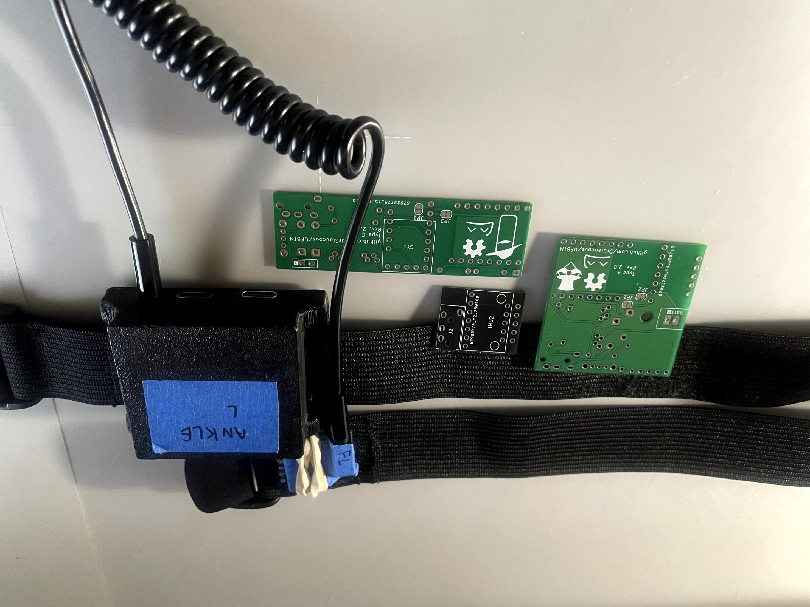

## Design goal

    Details

The components for these trackers have been chosen to be exclusively through-hole for ease of assembly (at a slight cost of a larger size)

The main IMU this design is based around is the BMI160, primarily for its low cost and small breakout footprint. This IMU is notorious for drifting, so it is also paired with a GY-271 magnetometer to mitigate some of the drift (depending on use location, the magnetometers may need to be disabled due to poor magnetic field).

<figure align = "center">
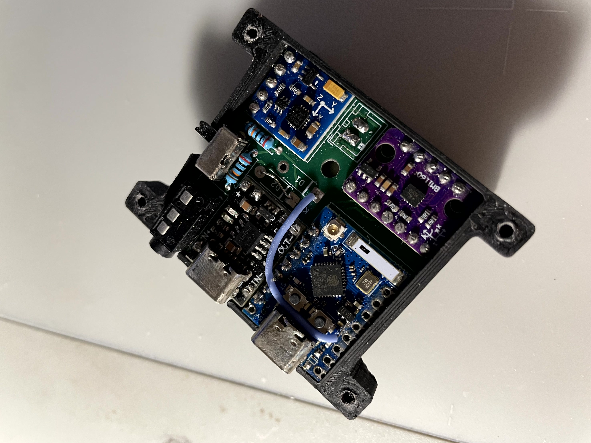
</figure>

This idea is by no means novel; I'm not even the first person to use the components I'm using, but I'm attempting to take a cost approach here. The full tracking set (10 modules + 5 extenders) should cost just north of $100 USD without print time costs or filament prices.

Assembly should be quick and reliable with no need for SMD or rework, which is something other modules of this size can't do.

The module uses TRRS (4 ring) aux jacks to connect between the main board and its extender, providing a robust connection that can last many plug cycles and be easily replaced if the plug *does* go bad.

## Compatibility

    MCU

### MCU
For the microcontroller, this board can support anything with the "superMini" form factor with the 8 or 9 pin length (including the s3 variants)

    

        

            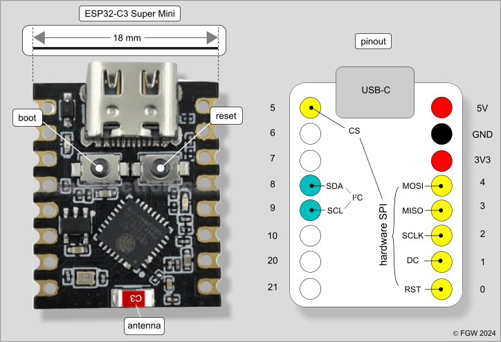
        

    

    

        

            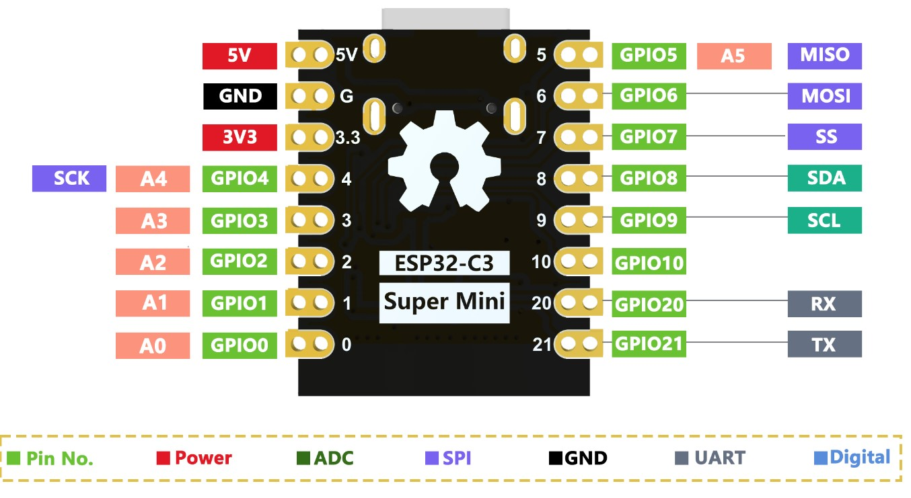
        

    

**Note: check to make sure the +5v, GND, and +3.3v on the board match the "standard" superMini layout as seen above! Some boards like to mix them around, like the one below.**

<figure align = "center">
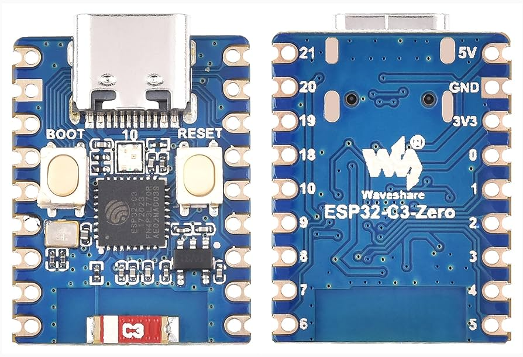
<figcaption align = "center"><i>Note how the power pins are on the opposite side from the normal superMini board</i></figcaption>
</figure>

---

    IMU

### IMU
The IMU can be anything that matches the BMI160 breakout form-factor.
This includes:
- The BMI160 itself
- The LSM6DS3 (*note: getting these from AliExpress will often just get you a re-badged BMI160.*)
- Slimevr "Mumo" boards hosting a CM-45686 module
- [Mofflab](https://moffshop.deyta.de/products/lsm6dsv-module) LSM6DSV modules *(I'm sure there are other vendors of these that I haven't mentioned, but these are all I could find while searching the internet. Join the SVR discord if you want to find better sources)*

    

        

            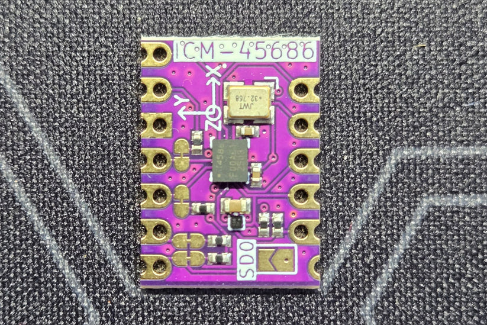
        

        

            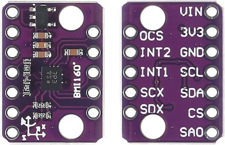
        

    

    

        

            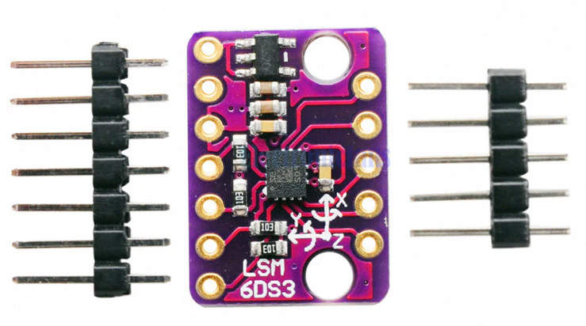
        

        

            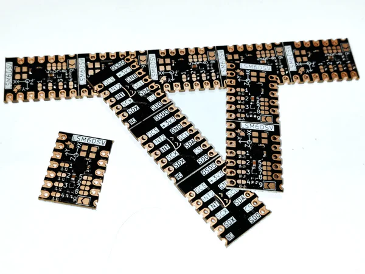
        

    

---

    Magnetometer

### Magnetometer

The PCB was designed to hold a GY-271 magnetometer breakout board.
These boards are common enough, but tend to have several variants of actual magnetometer on them, including:
- HMC5883L
- QMC5883L
- QMC5883P
All these are supported by my fork of the slimeVR firmware, but they have distinct registers, so you will have to check which one you have. (as-of-writing, the QMC5883P is the most common of these)

---

    Charger

### Charger

One of the most compact jellybean chargers are the `LX-LBES` chargers. They tend to come in 2 distinct sizes, and it's unreliable which one you might get. The PCB can support either of them though, so this shouldn't be a problem. 

Just make sure it's the `LX-LBES` module and not the other variants like the `LX-MILC` or `LX-LBC3`, both of which are similarly sized, but are incompatible.

<figure align = "center">
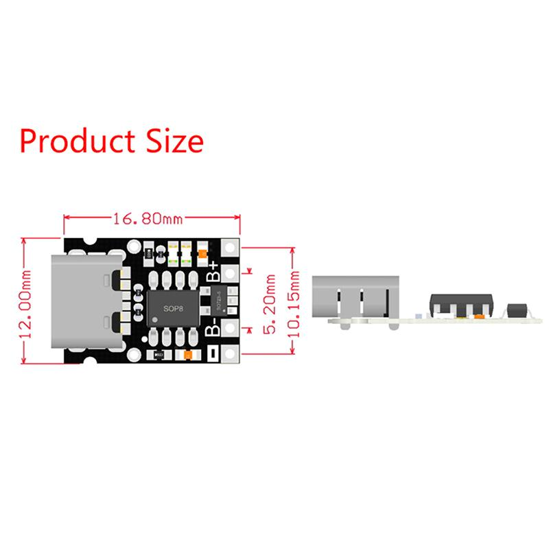
</figure>

---

    Charger

### Battery

This tracker is designed to work with 2 distinct battery sizes:
- The 804040 (a square flat-pack, Mr. Tracker)
- The 18650 (a common cylindrical battery, Mrs. Tracker)

Unfortunately, I have not modeled a housing for the 18650 variant yet.

18650 batteries are cheaper than the 804040s, especially if you get them used from a place like [batteryhookup](https://batteryhookup.com/), where they cost about 50c per battery. Depending on the quality of the cell, they can also hold more charge than the 804040s, but as a trade-off are inconveniently shaped for trackers. The Mrs. Tracker PCB is designed to accommodate these long, skinny batteries as best as possible.

<figure align = "center">
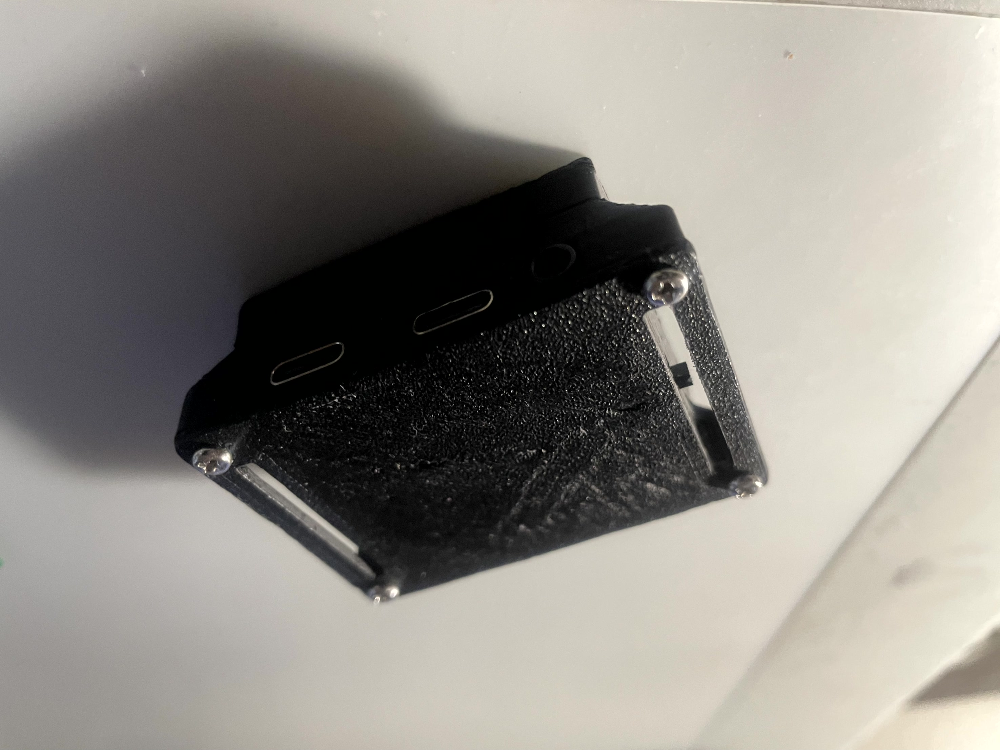
</figure>

The PCBs on this tracker are designed to be as modular as possible, accommodating a wide range of components based on price and availability.

---
***Note: The current tracker version has a problem that requires a bodge wire to solve. This is being fixed in the latest in-development PCB design.***

So like always,

